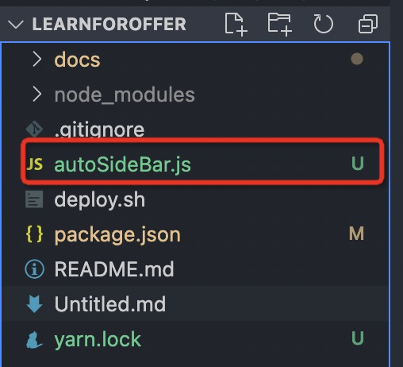

# vuepress-auto-sidebar-script

## vuepress 自动生成侧边栏脚本

vuepress 的侧边栏配置太烦人了，如果写了很多文档，并且还是多层级的话

纯写配置文件都是噩梦

默认主题的 sidebar: auto 也比较难用，而且没法显示全部文件的侧边栏

所以。。写了个 node 脚本自动生成一个配置

主要是为我的项目服务的，发出来谁跟我的情况一样就拿去用吧

另外，我项目的地址在 https://github.com/YuArtian/LearnForOffer

https://yuartian.github.io/

### Usage

1. 更改插件配置
   比如我的项目：
   
2. 将脚本放入 /docs 文件夹同一级，一般就是项目根目录
   比如我的项目：
   

3. 运行 `node autoSideBar`
4. 如果运气好不报错的话，会成功生成配置文件
5. 运气不好报错了，可能是你文件结构不对，请看下面的配置生成规则
6. 还是报错。。请自主排查错误，嘿嘿
7. 老子是用爱发电的，你不会指望我修bug吧 🐶

### 配置生成规则

比如你有如下目录

```text
.
├─ README.md
├─ contact.md
├─ about.md
├─ foo/
│  ├─ README.md
│  ├─ one.md
│  └─ two.md
└─ bar/
   ├─ three.md
   └─ four.md
```

则生成的配置为

```json
[
  {
    title: "contact",
    path: "/contact.md"
  },
  {
    title: "about",
    path: "/about.md"
  },
  {
    title: "foo",
    path: "/foo/"
    children: [
      {
    		title: "one",
    		path: "/one.md"
  		},
  		{
    		title: "two",
    		path: "/two.md"
  		}
    ]
  },
	{
    title: "bar",
    children: [
      {
    		title: "three",
    		path: "/three.md"
  		},
  		{
    		title: "four",
    		path: "/four.md"
  		}
    ]
  },
]
```

